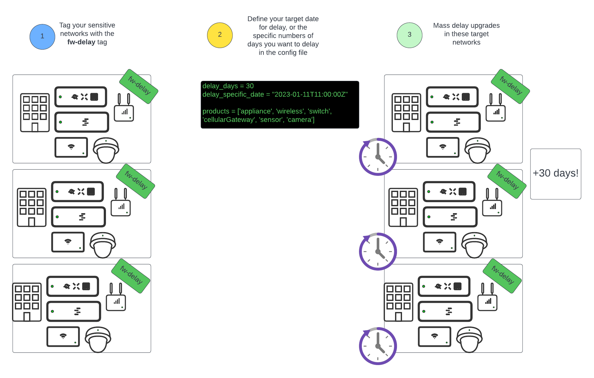
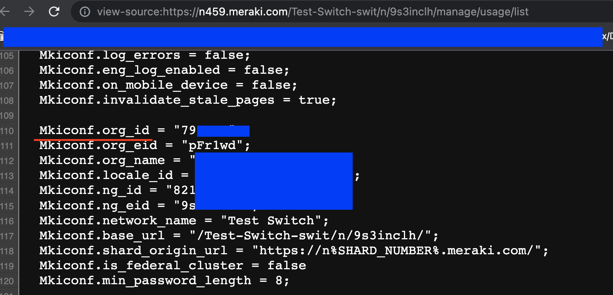
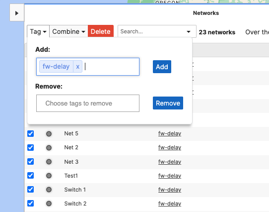

# merakiUpgradeSensitivity
Delay upgrades in sensitive Meraki networks to a specific date in the future or a set amount of days into the future.

# Table of Contents

[Introduction](#intro)

[Prerequisites](#prereq)

[How to use](#howtouse)

[Caveats](#caveats)

# Introduction

The Cisco Meraki platform makes the process of managing firmware upgrades across large fleets of devices very simple and intuitive, and it also helps its customers stay up to date with the latest patches and features by scheduling upgrades automatically for customers at their preferred time of day and time of the week. This is a big part of the value proposition of Cisco Meraki, as it ensures customers stay protected from the latest threats and delivers new functionalities in a timely manner, without running into orphaned networks that have not received upgrades in a very long time.

However, for some customer sites and deployments this behavior can be troublesome, as the customer may not be able to upgrade at that specific time or some of their key staff may be out during the programmed maintenance window. While it is possible to re-schedule these upgrades or even cancel them from the GUI, if you have very large numbers of sites it can be hard to do this at scale. This is why Meraki introduced a set of Firmware Upgrade management functionalities via their API.

This script allows a customer to identify a subset of networks through a tag (`fw-delay`), and delay the scheduled upgrades of these networks to a set time in the future, or offset by a certain number of days.

## Prerequisites

1. Active Cisco Meraki subscriptions in the orgs where the script will be run
2. API access enabled for these organizations, as well as an API Key with access to them. See how to enable [here](https://documentation.meraki.com/General_Administration/Other_Topics/Cisco_Meraki_Dashboard_API)
3. A working Python 3.0 environment
4. Install libraries in `requirements.txt`
5. Have some upgrades scheduled in your organization

## How to Use

1. Clone repo to your working directory with `git clone https://github.com/Francisco-1088/merakiUpgradeSensitivity.git`
2. Edit `config.py`
* Add your API Key under `api_key` in line 2
* Add the Organization ID of the organization where target networks exists. You can find your Org ID easily by right clicking anywhere in the screen while logged in to your organization, and clicking "View Page Source". In the resulting page use "Find" to look for the keyword `Mkiconf.org_id`

* List the products that you want to delay upgrades for on a per network basis. Acceptable options are `appliance`, `camera`, `cellularGateway`, `wireless`, `switch` and `sensor`. You should only include the specific product lines you want to delay upgrades for.
* Set either `delay_use_days` or `delay_use_specific_date` to `True`.
* If `delay_use_days` is set to `True`, specify a number of days into the future to delay your upgrades to. This can never be more than 30 days. The time of the upgrade will be kept the same, only the day in which it occurs will change.
* If `delay_specific_date` is set to `True`, specify a date in the future that you want to delay your upgrades to. This day cannot be more than 30 days into the future. In this case, time and date will be modified.
* OPTIONAL: Modify verbosity and logging settings. By default, the script will show you every step it's going through, and will prompt you before making any configuration changes. It is recommended to use it this way while you're testing the script, and for debugging purposes. `verbose` displays additional information about the data gathered from the source networks. `supervised` prompts you before every configuration change, allowing you to skip it. `console_logging` enables API log messages to appear in the console. You may set any of these to `False` if you do not want this level of logging.
3. Run `pip install -r requirements.txt` from your terminal
4. [Tag networks](https://documentation.meraki.com/General_Administration/Organizations_and_Networks/Organization_Menu/Manage_Tags) you want to work on with the same tag you defined in `config.py` under `delay_tag`

5. When tagging networks bound to templates, ALL networks bound to the template must have the `fw-delay` tag, as it is not possible to only upgrade a specific network in the template while not the others. The upgrade time will match whatever timezone you have configured in the child network.

6. Run the script with `python main.py` 

7. After executing the script, make sure to go to `Organization - Firmware upgrades - Scheduled changes` and verify that the new upgrade dates and times match your expectation

**Note:** If using the `supervised=True` configuration in the `config.py` file, every time the script will apply configuration changes it will prompt you to accept whether you want to continue or not. The prompt ONLY accepts `Y` for continuing, or `N` for skipping, and it is cap-sensitive. Any other input will break execution. 

## Caveats

1. This script cannot cancel upgrades
2. This script can only delay upgrades to a date 30 or fewer days into the future
3. If delaying networks bound to templates, all networks bound to the template must have the tag defined under `delay_tag`
4. It is not advisable to indefinitely delay upgrades, as this may compromise your deployment and make it vulnerable to security exploits, and will keep you from receiving the latest features from Cisco Meraki
5. If you need a good resource to automatically re-run this tool, [this article](https://towardsdatascience.com/how-to-schedule-python-scripts-with-cron-the-only-guide-youll-ever-need-deea2df63b4e) offers a good tutorial to schedule python scripts with Cron. In this case, probably the best use case for the script is delaying by a specific number of days using `delay_days` instead of a specific date with `delay_specific_date`
6. Start small, and test the script with a small number of networks, and progressively increase the number of sites until you get a feel for the time it takes for the script to gather data and push configs. 
